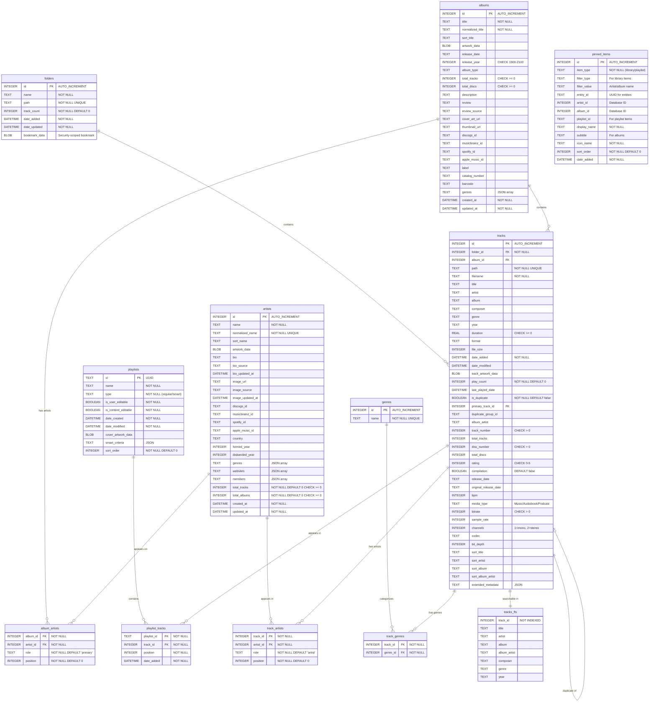

[English](README_EN.md)
 
## 概览
 
### ✨ 功能特性
 
- 你期望的离线音乐播放器该有的，这里都有！
- 支持丰富的音频文件格式：
  - MP3、AAC/M4A、WAV、AIFF、AIF、ALAC
  - Ogg Vorbis、Speex、Opus 以及 FLAC
  - APE（Monkey's Audio）
  - MPC（Musepack）
  - TTA（True Audio）
  - WV（WavPack）
  - DSF/DFF（Direct Stream Digital）
  - ……还有 MOD、IT、S3M、XM 和 AU
- 映射你的音乐文件夹，以结构化视图浏览资料库。
- 在有可用歌词时显示当前播放曲目的本地歌词。
- 创建、导入或导出播放列表。
- 通过拖拽交互式地管理播放队列。
- 需要时可用文件夹视图浏览音乐。
- 把几乎任何内容固定到侧边栏，快速访问你喜欢的音乐。
- 导航方便：右键点击曲目可直接跳转到对应的专辑、艺人、年份等。
- 原生 macOS 集成，支持菜单栏和程序坞播放控制，并支持深色模式。
- 能够很好地处理包含数千首歌曲的大型资料库。
 
💡 **提示**：Petrichor 的所有功能都非常依赖曲目拥有良好的元数据。
 
###  系统要求
 
- macOS 14 或更高版本
 
### ⚠️ 首次运行
 
如果你从 App Store 以外的渠道下载了发行版，且 macOS 以"来自身份不明的开发者"的提示阻止运行，
可以移除隔离属性：
 
```bash
sudo xattr -r -d com.apple.quarantine /Applications/Petrichor.app
```
 
### 🔒 隐私与数据访问
 
- Petrichor 运行在沙盒中，并经 Apple 公证。
- 它使用以下 macOS 权限：
  - **读写访问**
    - 用于读写用户选择的文件和文件夹，
      包括导出 M3U 播放列表，以及在歌曲属性中明确保存标签修改。
- 它不会（也永远不会）收集任何关于你使用方式的分析数据。
- 只有在你明确保存歌曲属性时才会修改音频标签；不会自动整理文件夹结构。
- 资料库保存在本地。“歌曲属性 → 在线获取标签”可按需使用网易云音乐或 QQ 音乐搜索：只有点击“搜索”才会发送填写的标题和艺术家，不上传音频文件。选中结果后可勾选要填入的字段，返回属性窗口点击“保存”才写入文件。此功能适用于单首可写入歌曲。
- 歌曲右键菜单或歌词面板中的“在线搜索歌词”支持搜索、预览、下载网易云音乐 / QQ 音乐同步歌词及翻译，保存为歌曲所在文件夹中的同名 UTF-8 `.lrc`。覆盖已有 LRC 前会确认；同名 KSC 仍优先显示。
- “设置 → 通用 → 歌词下载”可开启“自动下载缺失歌词”（默认关闭）。开启后仅为正在播放、缺少本地及内嵌歌词且标题、艺人和时长匹配的歌曲下载，不自动覆盖已有歌词。搜索会发送歌曲标题和艺人，获取歌词会发送候选歌曲 ID，不上传音频或修改音频文件。
 
## 🏗️ 开发
 
### 动机
 
我多年来收藏了大量音乐文件，却一直怀念 macOS 上有一款好用的离线音乐播放器。我试过几款免费和付费的方案，
但都缺少流媒体应用里常见的那种简洁与功能，于是我开发了 Petrichor 来满足这个需求，同时也顺便学习
Swift 和 macOS 应用开发！
 
### 实现概览
 
- 使用 Swift 和 SwiftUI 构建，部分采用 AppKit 以获得最佳的 macOS 集成。
- 添加包含音乐文件的文件夹后，应用会扫描这些文件夹、提取所需元数据，并填充到 SQLite 数据库中。
- 应用**不会**修改你的音乐文件，仅读取你添加的目录。
- 曲目搜索由 [SQLite FTS5](https://www.sqlite.org/fts5.html) 处理。
- 播放由 [AVFoundation](https://developer.apple.com/av-foundation/) 和第三方音频解码器处理。
 
<details>
<summary>查看数据库 Schema</summary>
 

 
</details>
 
### 鸣谢
 
Petrichor 的诞生离不开以下开源项目！
 
- [SFBAudioEngine](https://github.com/sbooth/SFBAudioEngine)
- [GRDB.swift](https://github.com/groue/GRDB.swift/)
 
### 开发环境
 
- 确保你运行的是 macOS 14 或更高版本。
- 安装 [Xcode](https://developer.apple.com/xcode/)。
- 克隆仓库并打开 `Petrichor.xcodeproj`。
 
#### 构建与发布
 
你可以无需 Apple 签名凭证，构建一个未签名的本地 `.dmg` 安装包：
 
```bash
Scripts/build-installer.sh --local
```
 
默认情况下，本地构建面向当前 Mac 的架构。如需指定安装包架构，可添加 `--universal`、`--arm-only` 或 `--intel-only`。
 
对于发布构建，你可以使用 [`build-installer.sh`](Scripts/build-installer.sh) 脚本进行签名和公证。
发布公证需要付费的 Apple 开发者账号；若只想签名而不公证，可使用 `--bypass-notary`。使用该脚本前，
请确保除 Xcode 外还安装了以下工具：
 
- [xcpretty](https://github.com/xcpretty/xcpretty)
- [create-dmg](https://github.com/create-dmg/create-dmg)
 
推送 tag 时，GitHub Actions 也会自动发布一个未签名的发行版。tag 名称会传递给
`Scripts/build-installer.sh --version`，用作打包的应用版本号。此 CI 发布流程不需要
Apple 签名证书或仓库密钥。
 
发布一个发行版：
 
```bash
git tag 1.2.3
git push origin 1.2.3
```
