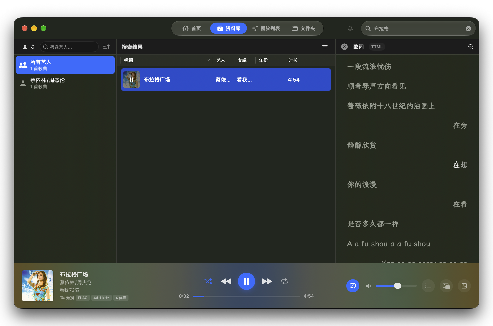
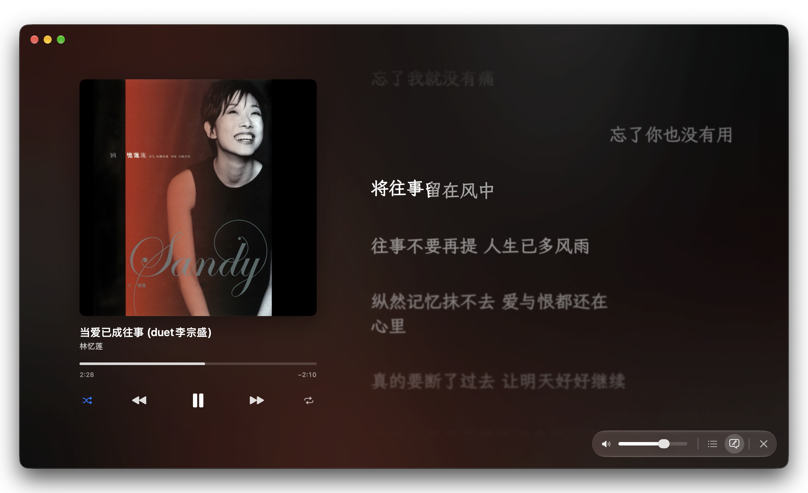

# Petrichor

一款原生 macOS 本地音乐播放器，用清晰的资料库、随专辑封面变化的界面和同步歌词，让收藏的音乐更方便浏览、也更适合专心聆听。

使用 Swift、SwiftUI 和 AppKit 构建。添加自己的音乐文件夹，即可离线浏览和播放；需要补齐歌曲资料时，也可以按需搜索标签、歌词和封面。

[下载安装](https://github.com/iuxt/Petrichor/releases) · [反馈问题](https://github.com/iuxt/Petrichor/issues)

## 特点

1. 使用 Swift、SwiftUI 和 AppKit 构建
2. 支持Apple Music 的 ttml 格式的歌词，歌词特点：逐字歌词、对唱、多语言切换（如简繁切换）
3. 支持自动下载封面、歌词、歌曲标签（通过QQ音乐和网易云音乐接口）
4. 支持通过预览快速调整歌词时间
5. 不支持任何AI功能

## 界面预览

### 资料库与同步歌词

通过顶部导航切换首页、资料库、播放列表和文件夹，左侧按艺人、专辑等分类筛选，中间查看与搜索歌曲，右侧显示同步歌词。底部播放器集中展示封面、歌曲信息、播放进度和音频格式。



### 全屏歌词

大幅专辑封面与滚动歌词并排呈现，背景随封面色彩变化。逐字高亮跟随演唱进度，点击带时间的歌词行可以跳转播放；也能随时切换到播放队列。

右键歌词可下载、重载、复制或调整歌词时间；右键封面可打开当前歌曲的操作菜单，查看信息、编辑标签、搜索封面或添加到播放列表。



## 主要功能

### 浏览自己的音乐收藏

- **多种浏览方式**：首页提供歌曲、艺人和专辑浏览，资料库可按艺人、专辑、专辑艺人、作曲者、流派、年份和年代筛选。
- **搜索与排序**：搜索资料库中的歌曲，按列表字段排序，并调整歌曲列表的显示密度。
- **文件夹视图**：直接按已添加目录的层级浏览音乐，可在外观设置中开启文件夹标签页。
- **固定常用内容**：把常听的艺人、专辑或分类固定到侧边栏；歌曲右键菜单也可直接跳转到相关分类或在 Finder 中显示文件。
- **资料库维护**：定时扫描已添加文件夹，发现新音乐；可隐藏重复歌曲，优先显示质量更高的版本。
- **重新发现收藏**：首页的“发现”从本地资料库中挑选尚未播放的歌曲。

### 播放与音效

- 支持顺序播放、随机播放、列表循环和单曲循环。
- 通过“下一首播放”和“添加到队列”安排接下来要听的歌曲，支持拖拽调整队列顺序。
- 内置 **10 段均衡器**，提供音效预设、自定义调节、前置增益和立体声扩展。
- 可切换现代与经典播放引擎；现代引擎支持无缝播放，适合连续专辑和现场录音。
- 在播放器中显示编码格式、码率、采样率、声道和无损标识。

### 歌词与不同播放界面

- **主窗口歌词面板**：浏览资料库的同时查看当前歌曲的同步歌词。
- **全屏歌词**：突出专辑封面与歌词，支持逐字高亮和点击歌词跳转。
- **迷你播放器**：用独立小窗口显示封面、歌曲信息、播放控制和歌词，可设置始终置顶。
- **桌面歌词**：用悬浮窗口显示同步歌词，可锁定并让鼠标点击穿透。
- **本地歌词**：读取同名 `.ttml`、`.ksc`、`.lrc`、`.srt` 文件及内嵌歌词；TTML 对唱歌词按演唱者左右排列。
- **歌词管理**：右键菜单提供重载、复制、时间校准和本地歌词文件管理；包含可用语言版本的 TTML 可切换歌词语言。
- **显示偏好**：分别调整侧栏、全屏和桌面歌词的字体与大小。

### 播放列表

- 创建普通播放列表，添加或移除歌曲，并调整歌曲顺序。
- 普通播放列表保存为音乐文件夹下 `playlists/` 目录中的 `.m3u` 文件；也会读取该目录已有的 `.m3u` 和 `.m3u8` 列表。
- 创建智能播放列表，按艺人、流派、年份、播放次数、添加日期等条件筛选，可设置排序和数量限制。

### 标签、歌词与封面补全

| 内容 | 来源 | 使用方式 |
| --- | --- | --- |
| 歌曲标签 | 网易云音乐、QQ 音乐 | 在歌曲属性中搜索，选择要填入的字段，保存后写入音频标签 |
| 同步歌词 | AMLL、网易云音乐、QQ 音乐 | 手动搜索下载，或开启自动下载缺失歌词 |
| 专辑封面 | 网易云音乐、QQ 音乐 | 手动搜索下载，或开启自动下载缺失封面 |

AMLL 歌词保留为同名 `.ttml`，网易云音乐和 QQ 音乐歌词保存为同名 UTF-8 `.lrc`。下载的封面以 JPEG 保存到音频所在目录，已有的内嵌封面和本地封面也可直接使用。

自动歌词和自动封面是两个独立开关，**默认均关闭**。开启后为当前播放且缺少对应内容的歌曲匹配下载；自动封面也可在保存在线标签后补齐。自动下载不会覆盖已有歌词或封面。

### macOS 集成与外观

- 菜单栏和 Dock 播放控制，关闭主窗口后可继续在菜单栏运行。
- 支持媒体键、键盘快捷键，以及通过“快捷指令”控制播放或播放指定艺人、专辑和播放列表。
- 浅色、深色或跟随系统的外观，支持中文和英文界面。
- 从专辑封面提取颜色，为背景、播放器和控制按钮着色，也可按偏好关闭。

## 支持的音频格式

| 类型 | 格式 |
| --- | --- |
| 常见格式 | MP3、AAC / M4A、ALAC、WAV、AIFF / AIF |
| 更多压缩格式 | FLAC、APE、WavPack（WV）、Musepack（MPC）、TTA、Ogg Vorbis（OGG / OGA）、Opus、Speex（SPX） |
| DSD | DSF、DFF |
| 其他 | MOD、IT、S3M、XM、AU |

## 安装与开始使用

系统要求：**macOS 15 或更高版本**，支持 Apple Silicon 和 Intel Mac。

1. 从 [GitHub Releases](https://github.com/iuxt/Petrichor/releases) 下载 DMG，将 Petrichor 拖入“应用程序”目录。
2. 打开应用，点击“添加音乐文件夹”，选择自己的音乐目录并等待扫描完成。
3. 在资料库中浏览或搜索歌曲，双击开始播放；使用底部播放器打开歌词、队列、迷你播放器或全屏歌词。
4. 按需在设置中调整外观、扫描频率、歌词字体及自动下载选项。

当前仓库的自动发布流程生成**未签名、未公证**的安装包，首次打开可能触发 macOS 安全提示，请留意对应版本的发布说明。

资料库分类依赖歌曲的标题、艺人、专辑等元数据。遇到信息缺失或分类不准确的歌曲，可以通过右键菜单打开歌曲属性，手动编辑或在线补齐标签。

### 使用已有歌词

将歌词与音频放在同一目录，并使用相同文件名，例如：

```text
音乐/
├── Song.flac
└── Song.ttml
```

同名歌词按 **TTML → KSC → LRC → SRT** 的优先级读取，无有效旁车歌词时回退到内嵌歌词。使用本地歌词无需联网。

## 本地文件与隐私

资料库和播放数据保存在本机，应用通过 macOS 沙盒访问用户选择的目录，不收集使用分析数据，也不上传音频文件。

日常扫描与播放不会改写音频或重新整理文件夹。保存歌曲属性时才写入音频标签；播放列表、下载的歌词和封面作为独立文件保存。将歌曲或播放列表移到废纸篓，以及保存歌词时间调整，均由用户明确操作触发。

在线标签、歌词和封面功能只向所选来源发送匹配所需的歌曲信息或候选 ID。联网下载按手动操作或用户开启的自动下载选项执行。

## 开发

使用 macOS 和 Xcode，打开 `Petrichor.xcodeproj`，选择 `Petrichor` scheme 即可构建：

```bash
xcodebuild -project Petrichor.xcodeproj -scheme Petrichor -configuration Debug build
```

本地构建并安装使用仓库根目录的 [build.sh](build.sh)：

```bash
./build.sh
```

脚本默认构建当前 Mac 架构的 Release 应用，不需要开发签名证书或公证，不生成 DMG。构建成功后先正常退出正在运行的 Petrichor，再安装到 `/Applications/Petrichor.app` 并替换旧版本，随后自动启动新版本。应用未能退出时会停止安装，保留旧版本。目录权限不足时会通过 `sudo` 请求管理员权限。

使用 `./build.sh --universal` 构建通用版，或用 `./build.sh --no-install` 仅构建（不退出或启动应用）；应用和构建日志保存在 `build/local-AppleSilicon/`、`build/local-Intel/` 或 `build/local-Universal/` 中。可通过 `--install-dir <目录>` 更改安装位置。

GitHub Actions 继续使用 [发布打包脚本](Scripts/build-installer.sh) 生成通用版 DMG、SHA256 校验文件并发布 Release。开发与验证约定见 [AGENTS.md](AGENTS.md)。

### 鸣谢

- [SFBAudioEngine](https://github.com/sbooth/SFBAudioEngine) 与 [CrescendoKit](https://github.com/kushalpandya/CrescendoKit)：音频播放与解码。
- [GRDB.swift](https://github.com/groue/GRDB.swift)：本地 SQLite 资料库。
- [AMLL TTML 歌词库](https://github.com/amll-dev/amll-ttml-db)：在线 TTML 歌词来源。

许可证见 [LICENSE](LICENSE)。
